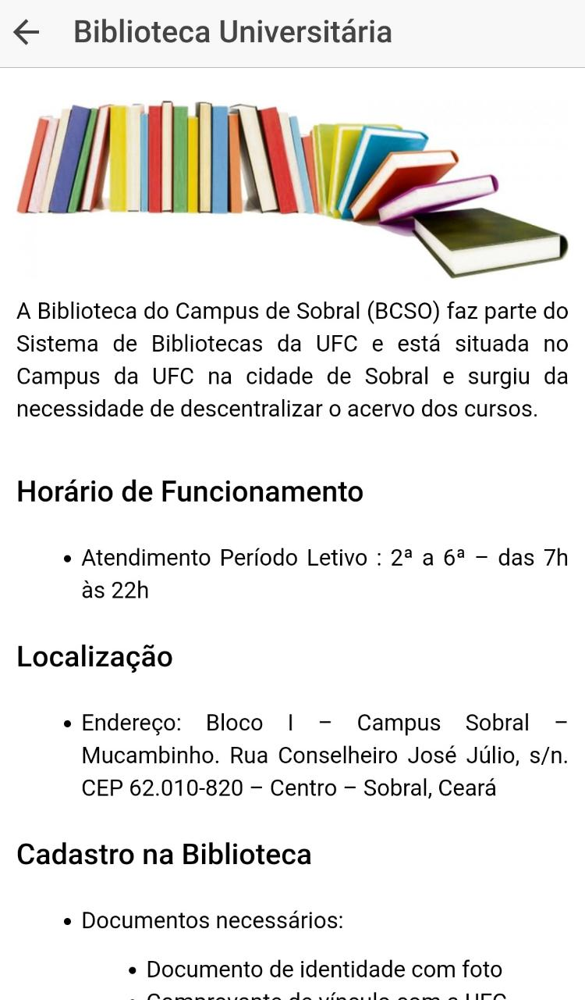
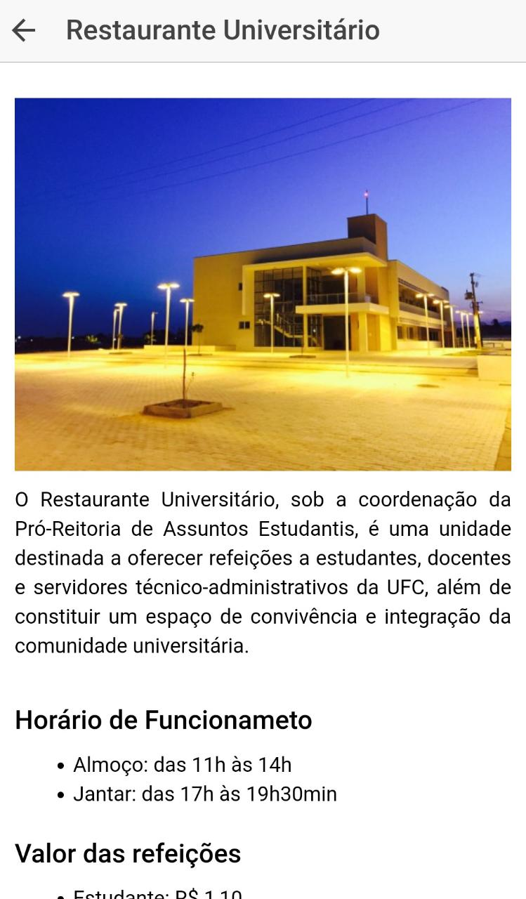
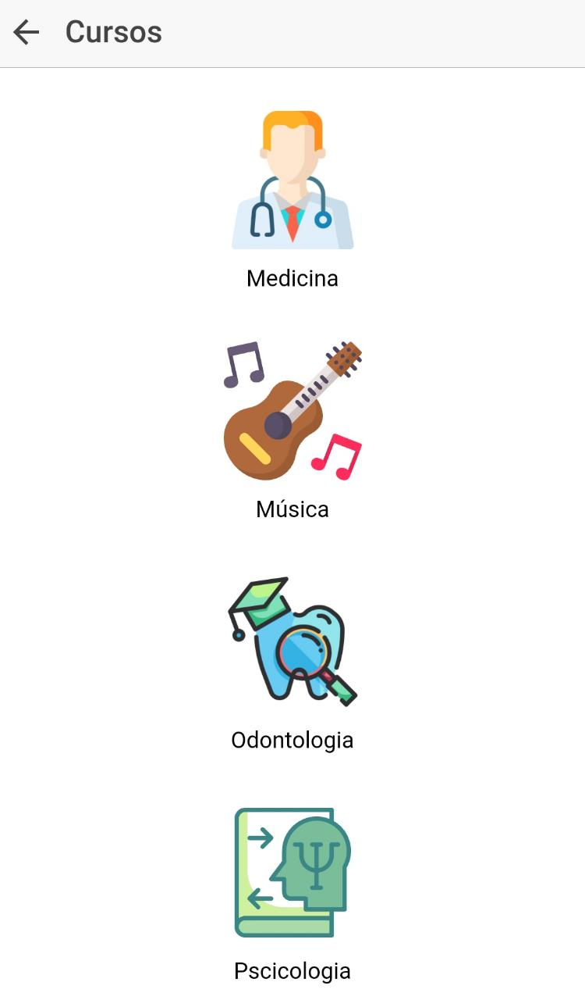
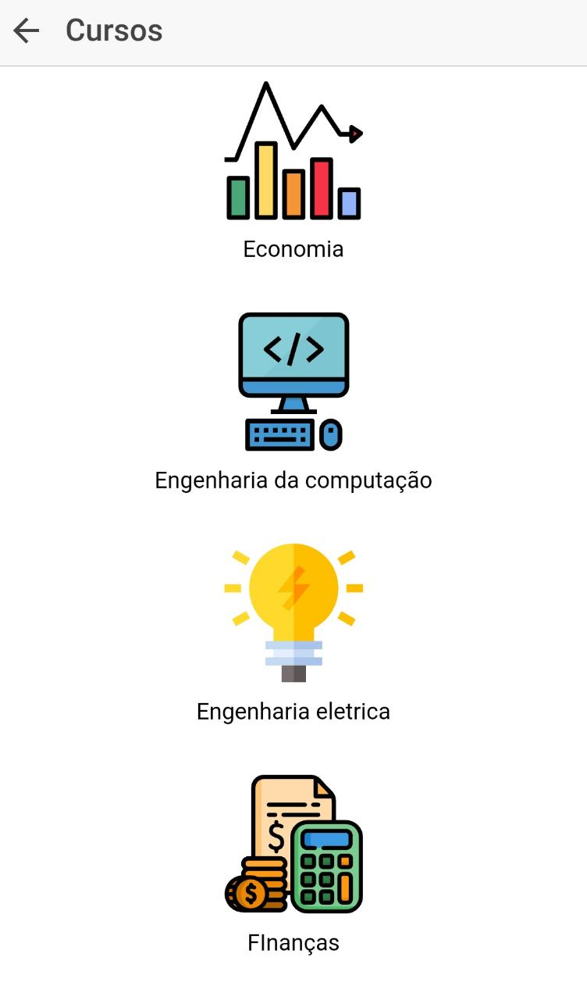
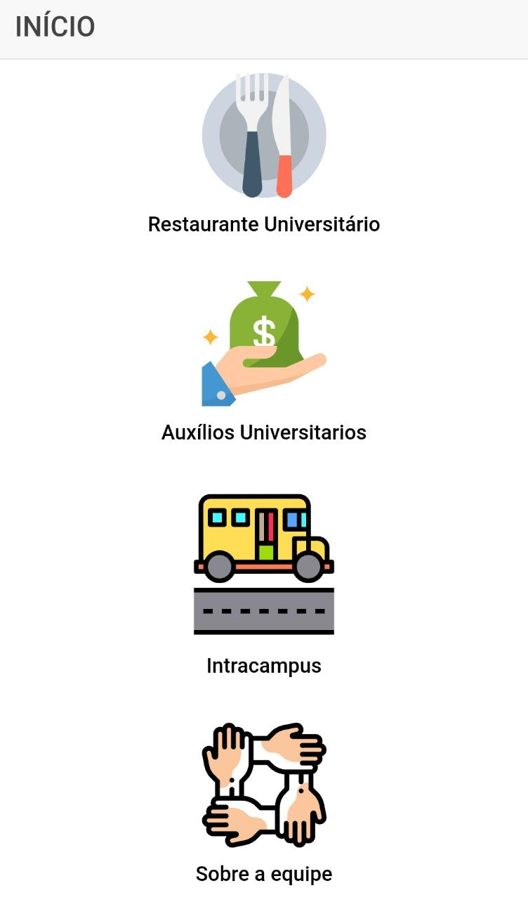

# My-college-buddy
Este projeto desenvolveu o aplicativo “My college buddy”, na qual possui como público-alvo
alunos ingressantes dos cursos da Universidade Federal do Ceará, campus Sobral. O projeto
possui como ímpeto inicial colaborar com os estudantes e informá-los aos diversos assuntos
básicos, referentes a faculdade que serão essenciais para a sua vivência.

Deste modo, o aplicativo desenvolvido com o framework Ionic, abordará
informações sobre bolsas e auxílios, biblioteca universitária, restaurante universitário,
intracampus, além de dados sobre os oito cursos e os projetos de extensão e oportunidades
em cada um deles.

